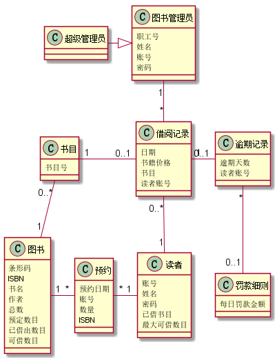

# 实验3：图书管理系统领域对象建模
|      学号    |    班级        |    姓名      |     照片  |   
|:------------:|:-------------- | ------------:|:--------- | 
| 201510414204 | 软件（本） 15-2|   杨鹏     |     无    |  
## 1. 图书管理系统的类图
### 1.1 类图PlantUML源码如下：
```
@startuml
class 书目{
     书目号
}
class 图书{
    条形码
    ISBN
    书名
    作者
    总数
    预定数目
    已借出数目
    可借数目
}
class 预约{
    预约日期
    账号
    数量
    ISBN
}
class 读者{
    账号
    姓名
    密码
    已借书目
    最大可借数目
}
class 借阅记录{
    日期
    书籍价格
    书目
    读者账号
}
class 逾期记录{
    逾期天数
    读者账号
}
class 罚款细则{
   每日罚款金额
}
class 图书管理员{
    职工号
    姓名
    账号
    密码
}
class 超级管理员{
}

书目 "0..*" - "1" 图书
图书 "1"--right--"*"预约
预约 "*"-right-"1"读者
读者 "1"-up-"0..*"借阅记录
借阅记录 "0..1"-left-"1"书目
借阅记录 "1"-"0..1"逾期记录
借阅记录"*"-up-"1"图书管理员
逾期记录"*"--"0..1"罚款细则
图书管理员<|-left-超级管理员
@enduml

```
### 1.2 类图如下：

### 1.3. 类图说明：
该类图主要有图书类、预约类、读者类、书目类、借阅记录类、图书管理员类、逾期记录及罚款细则类，其中
书目类与图书类、预约类与图书类、读者类与预约类、借阅记录与读者类存在多对一的关系,书目类与借阅记录类、逾期记录和借阅
记录类存在一对一或者一对零的关系。超级管理员继承了图书管理员类，每个类的属性及细节见上图
## 2. 图书管理系统的对象图
### 2.1 类图书的对象图
#### 源码如下：
```
@startuml

object 图书{
     ISBN:978-7-302-32982-4
     书名:信息系统分析与设计
     作者:王晓敏
     总数:20
     预定数目:1
     已借出数目:3
     可借数目:16
}
@enduml
```
#### 对象图如下：


### 2.2 类借阅记录的对象图
#### 源码如下：
```
@startuml

object 借阅记录{
        日期:2018/4/15
        书籍价格:￥35
        书目:信息系统分析与设计
        读者账号:201817162636
}
@enduml
```
#### 对象图如下：


### 2.3 类读者的对象图
#### 源码如下：
```
@startuml

object 读者{
        账号：201817162636
        姓名：张三
        密码：******
        已借书目：3
        最大可借数目：20
}
@enduml
```
#### 对象图如下：


### 2.4 类预约的对象图
#### 源码如下：
```
@startuml

object 预约{
         预约日期：2018/4/10
         账号：201817162636
         数量：1
         ISBN：978-7-302-32982-4
}
@enduml
```
#### 对象图如下：


### 2.5 类图书管理员的对象图
#### 源码如下：
```
@startuml

object 图书管理员{
         职工号：19383473
         姓名：李四
         账号：1234
         密码：***
}

@enduml

```
#### 对象图如下：


### 2.6 类逾期记录的对象图
#### 源码如下：
```
@startuml

object 逾期记录{
        逾期天数：4
        读者账号：2019232792
}
@enduml
```
#### 对象图如下：


### 2.6 类罚款细则的对象图
#### 源码如下：
```
@startuml

object 罚款细则{
         每日罚款金额：￥0.5
}
@enduml
```
#### 对象图如下：

