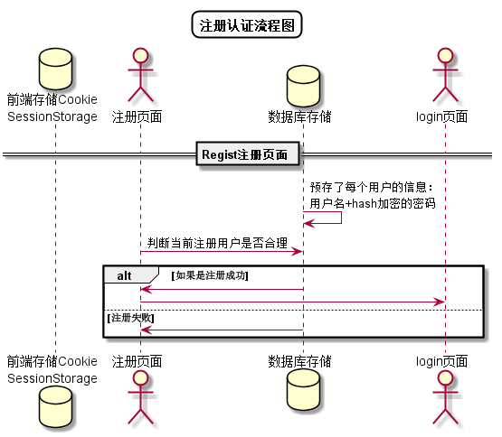

<!-- markdownlint-disable MD033-->
<!-- 禁止MD033类型的警告 https://www.npmjs.com/package/markdownlint -->

# “注册”用例 [返回](../../README.md)

## 1. 用例规约

|用例名称|注册|
|-------|:-------------|
|功能|注册平台|
|参与者|访客|
|前置条件| |
|后置条件|注册成功后，跳转到登录界面|
|主事件流| 1. 访客输入用户名和密码，选择用户类型 2.系统判断用户数据在数据库数据中是否存在 
|备选事件流|1a. 输入的用户名或者密码为空  &nbsp;&nbsp; 1.提示重新输入   &nbsp;&nbsp; 2.访客重新提交注册信息    

## 2. 业务流程
无

## 3. 界面设计
- 界面参照: https://github.com/yimoqiuyi/is_analysis/test6/ui/regist.png
- API接口调用
    - 接口1：[regist](../mapper/regist.md)

## 4. 算法描述 [源码](../main/regist.puml)

    
## 5. 参照表

- [USERS](../../DataDesign.md/#USERS)